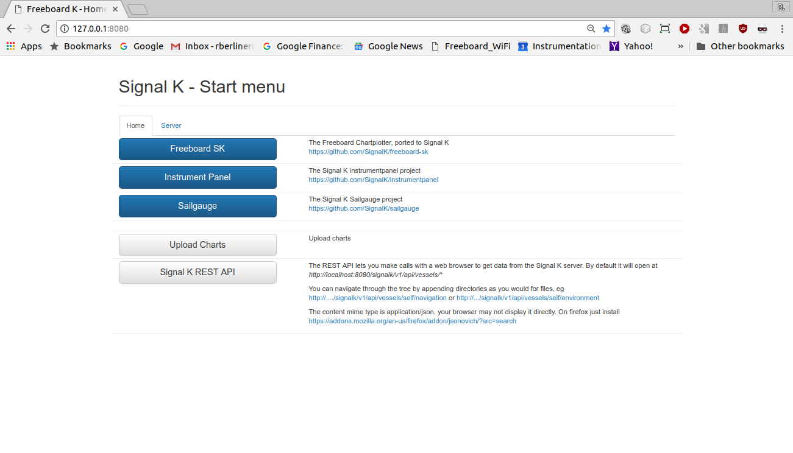
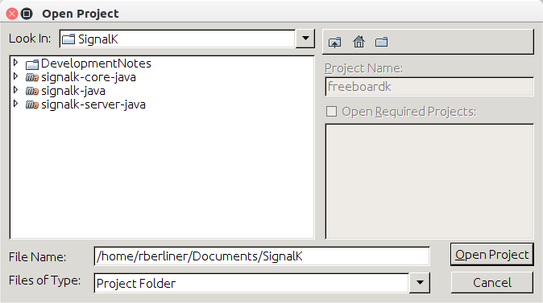
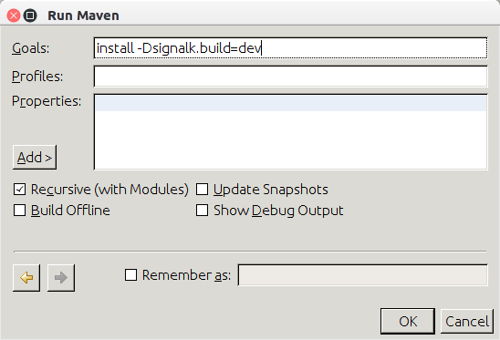

##Developing SignalK 

These notes may help others to start working on SignalK themselves – there is a bit of a learning curve with servers, maven, git, github.... These instructions were prepared for Ubuntu-linux but can probably be applied to Windows with some adjustments.

signalk-java is the java form of the system and it is contained in 4 projects (repositories) on github and that can be found at https://github.com/SignalK

## Install the Tools 


** Install git. **  
```
$ sudo apt-get update  
$ sudo apt-get install git
$ git –version  
git version 2.7.4  
```


** Install maven. **  
```
$ sudo apt-get install maven  
$ mvn -version
Apache Maven 3.3.9   
Maven home: /usr/share/maven   I
Java version: 1.8.0_111, vendor: Oracle Corporation   
Java home: /usr/lib/jvm/java-8-oracle/jre   
Default locale: en_US, platform encoding: UTF-8   
OS name: "linux", version: "4.4.0-71-generic", arch: "amd64", family: "unix"  
```

** Create the local repositories. **

1. Start by creating a directory SignalK. Open the SignalK directory in the Terminal.  
2. In any browser, go to https://github.com/SignalK  
3. Once you are there you will be faced with a number of different repositories. Too many to understand all at one time. Select the signalk-core-java repo.
4. On the right hand side of the page there will be a green box. When you click the box, the Clone with HTTPS box will open. Click on the clipboard icon to copy the address to the clipboard.
5. In the terminal type clone and then paste in the repo address. You will get a line:
    
    ```
    :~/SignalK$ clone https://github.com/SignalK/signalk-core-java.git https://github.com/SignalK/signalk-core-java.git
    ```
    
6. Type return. This will provide you with your own local signalk-core-java repo. 
7. In the SignalK directory, in the terminal again, do the same thing for the signalk-server-java repo from github and for the signalk-java repo.

You will now have a directory, SignalK, containing the three local repositories:
    
>SignalK/  
>&nbsp;&nbsp;&nbsp;&nbsp;&nbsp;&nbsp; signalk-core-java  
>&nbsp;&nbsp;&nbsp;&nbsp;&nbsp;&nbsp; signalk-server-java  
>&nbsp;&nbsp;&nbsp;&nbsp;&nbsp;&nbsp; signalk-java  
    
Open a terminal in ~SignalK/signalk-java/signal-static. In github, find the freeboard-sk repo and clone it so that the freeboard-sk repo exists in your SignalK/signalk-java/signalk-static directory.

##Building project in terminal  
  
1. Open Terminal in signalk-core-java and do a mvn install (adjusted for your directory location).  
  
    ```
    :~/Documents/SignalK/signalk-core-java$ mvn install      
    ```  
  
2. Open Terminal in signalk-server-java and do maven install with the indicated options.  
The -Dsignalk.build=dev instructs maven to use the development build and not to download the build from the net.  
The -Dmaven.test.skip=true causes the tests to be skipped (they take a long time).  
    ```
    :~/Documents/SignalK/signalk-server-java$ mvn -Dsignalk.build=dev install -Dmaven.test.skip=true.  
    ```  
3. Open a third terminal in freeboard-sk, and run npm install.  
The first time you run npm install, it will download a large number of javascript packages and the process will take a long time. Since I have run it before, it now does very little.
    
    ```
    :~/Documents/SignalK/signalk-java/signalk-static/freeboard-sk$ npm install  
    ```
    
     Delete bundle.js and then run npm start.   
    

4. Then execute npm start.  
```:~/Documents/SignalK/signalk-java/signalk-static/freeboard-sk$ npm start```  
```> @signalk/freeboard-sk@0.0.4 start /home/rberliner/Documents/SignalK/signalk-java/signalk-static/freeboard-sk```  
```> watchify index.js --exclude mdns --ignore bufferutil --ignore utf-8-validate --outfile bundle.js```  
  
Now any changes in the freeboard-sk source js files will cause  bundle.js to be regenerated. The file bundle.js is the minified code for freeboard-sk including all of its js dependencies. Changes in bundle.js may not be reflected in your browser rendition of freeboard unless you clear the browser cached files (In Chrome it is MoreTools > Clear Browsing Data, select cached images and files.)  
  
npm start runs watchify which looks for changes in the js files and regenerates bundle.js when necessary.  
  
The program can be run by opening a terminal in signalk-java.  
  
```:~/Documents/SignalK/signalk-java$ mvn -Dsignalk.build=dev exec:java```  
  
You can observe is operation by going to Firefox or Chrome and putting in the address bar http://127.0.0.1:8080. You should get the SignalK start menu.  
  
<a href="" target="_blank"></a>

To run the program from a terminal and have it continue to execute when the terminal is closed:  
  
```:~/Documents/SignalK/signalk-java$ nohup mvn -Dsignalk.build=dev exec:java &```  
  
It may be necessary to delete ```signalk-java/conf/self.json```, ```signalk-java/conf/signalk-config.json``` and 
```signalk-java/conf/resources.json``` **before starting**  to get a clean start.  

##Debug SignalK with Eclipse  
  
Import projects into workspace. (File > Import)  
  
Select Maven, Existing Maven Project,  
  
Next Select the pom and Add project to working set, Finish.  

##Build, Run and Debug SignalK using NetBeans  

** Build SignalK **

Netbeans can be downloaded and installed following the instructions at https://netbeans.org  

I am currently using Netbeans 8.2 with the JDK 1.8 as the default.

Open Netbeans and from the Menu Bar, go to File > Open Project and navigate to the SignalK directory. The three repository directories should appear as Netbeans projects.   

<a href="" target="_blank"></a>

Select all three and choose Open Project.  

To build a development version of signalk-core-java and signalk-server-java, right-click on the project in the Project window and select Run Maven > Goals. You get a window that allows you to enter the Maven goals. 

<a href="" target="_blank"></a>  

In the case of signalk-core-java, the goal is ```install```.  

I have not used NetBeans to build freeboard-sk and continue to do that in a terminal using npm.

** Run SignalK **

To run the project in NetBeans, right-click on the signalk-java project and select Maven > Goals.

<a href="" target="_blank"></a>  

** Debug SignalK **

To debug the project using NetBeans, follow the same procedure as "Run SignalK" but click on the Add button and select Debug Maven Project. You get the following result:

<a href="" target="_blank"></a>  

Then click OK. You will now stop at breakpoints you have set and you can add others as the program runs.


